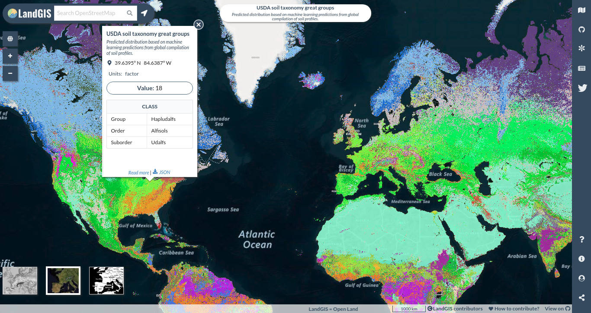
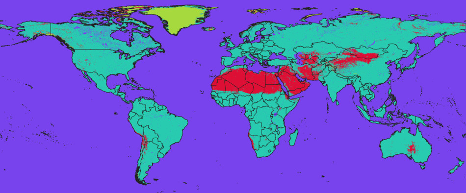

LandGIS — Open Land Data service
================================
[Hengl, T.](https://github.com/thengl) and [Kilibarda, M.](https://github.com/milankili)

| <a href="https://github.com/thengl"></a> | <a href="https://github.com/milankili"></a> |
|-------------------------------------------------------------------------------------------------------------------------------------------------|------------------------------------------------------------------------------------------------------------------------------------------------------|

-   [General specifications](#landgis)
-   [Accessing data](#accessing-data)
-   [The file naming convention](#the-file-naming-convention)
-   [The land mask](#the-land-mask)
-   [Relief and geology](#relief-and-geology)
-   [Land cover, land use and administrative data](#land-cover-land-use-and-administrative-data)
-   [Vegetation indices](#vegetation-indices)
-   [Land degradation indices](#land-degradation-indices)
-   [Climatic layers](#climatic-layers)
-   [Soil properties and classes](#soil-properties-and-classes)
-   [Potential natural vegetation](#potential-natural-vegetation)
-   [References](#references)

------------------------------------------------------------------------

<a href="https://creativecommons.org/licenses/by-sa/4.0/" target="_blank"></a>

------------------------------------------------------------------------

LandGIS
-------

LandGIS is a Web-GIS system providing access to spatial layers and services covering global land mass
(at spatial resolutions of 1 km, 250 m or finer resolution). It aims at becoming an OpenStreetMap for land data.
Access to spatial layers is possible via interactive visualizations and/or Open Source software solutions. 
Read more about this project [here](http://opengeohub.org/about-landgis/).


The LandGIS layers, if not specified otherwise, are licensed under the 
[Creative Commons Attribution-ShareAlike 4.0 International license](https://creativecommons.org/licenses/by-sa/4.0/legalcode) (CC BY-SA) and/or
the [Open Data Commons Open Database License](https://opendatacommons.org/licenses/odbl/) (ODbL). This implies that anyone can use, 
or build upon, the LandGIS data without restrictions.
See the [Copyright and License](http://opengeohub.org/about-landgis/) page for more details.


Accessing data
--------------

Users can access LandGIS data via the four main channels:

- **LandGIS App** at https://landgis.opengeohub.org,
- **OpenGeoHub Geonode** installation at https://maps.opengeohub.org,
- **LandGIS REST API services** at https://landgisapi.opengeohub.org,
- [Zenodo.org](https://zenodo.org/search?page=1&size=20&q=LandGIS) to access a (version-controlled) back-up copy of data via a DOI,

Data portal https://landgis.opengeohub.org is the landing page where users can browse maps, query values by
location, and find out about most recent news and activities. Geonode at https://maps.opengeohub.org 
is a generic layer repository for accessing layers installed via OpenGeoHub Geoserver. 
It allow users i.e. producers of layers to edit and update metadata and descriptions, 
create map views, learn how to use WCS, WMS or similar. A copy of the raw data can be obtained 
via zenodo.org or similar public data repositories.

LandGIS data services REST API (https://landgisapi.opengeohub.org) contains scripts and functions 
that allow users to and developers to fetch raw data (point queries) in some simple textual 
formats such as GeoJSON, csv, compressed GeoTIFFs or similar. The following query would fetch monthly precipitations at a location X, Y: 

```
http://landgisapi.opengeohub.org/point?lat=7.58033&lon=35.6561&coll=layers1km&regex=clm_precipitation_imerge.(jan|feb|mar|apr|may|jun|jul|aug|sep|oct|nov|dec)_m_1km_s0..0cm_.*_v0.1.tif
```

which results in:

```
Project description	
0	"https://opengeohub.org/about-landgis"
Description of all codes	
0	"https://github.com/envirometrix/landGISmaps/"
response	
0	
lon	35.6561
lat	7.5803
clm_precipitation_imerge.apr_m_1km_s0..0cm_2014..2018_v0.1.tif	149
clm_precipitation_imerge.aug_m_1km_s0..0cm_2014..2018_v0.1.tif	194
clm_precipitation_imerge.dec_m_1km_s0..0cm_2014..2018_v0.1.tif	48
clm_precipitation_imerge.feb_m_1km_s0..0cm_2014..2018_v0.1.tif	51
clm_precipitation_imerge.jan_m_1km_s0..0cm_2014..2018_v0.1.tif	56
clm_precipitation_imerge.jul_m_1km_s0..0cm_2014..2018_v0.1.tif	184
clm_precipitation_imerge.jun_m_1km_s0..0cm_2014..2018_v0.1.tif	198
clm_precipitation_imerge.mar_m_1km_s0..0cm_2014..2018_v0.1.tif	109
clm_precipitation_imerge.may_m_1km_s0..0cm_2014..2018_v0.1.tif	203
clm_precipitation_imerge.nov_m_1km_s0..0cm_2014..2018_v0.1.tif	81
clm_precipitation_imerge.oct_m_1km_s0..0cm_2014..2018_v0.1.tif	152
clm_precipitation_imerge.sep_m_1km_s0..0cm_2014..2018_v0.1.tif	197
```

to determine a soil type (USDA great group) use:

```
http://landgisapi.opengeohub.org/point?lat=30.2543&lon=-95.5811&coll=predicted250m&regex=sol_grtgroup_usda.soiltax_c_250m_s0..0cm_1950..2017_v0.1.tif
```

which gives e.g.:

```	
Project description	
0	"https://opengeohub.org/about-landgis"
Description of all codes	
0	"https://github.com/envirometrix/landGISmaps/"
response	
0	
lon	-95.5811
lat	30.2543
sol_grtgroup_usda.soiltax_c_250m_s0..0cm_1950..2017_v0.1.tif	30
info	
0	
X	30
Number	30
Group	"paleudalfs"
Great_Group_2015_match	"Paleudalfs"
Suborder	"Udalfs"
Order	"Alfisols"
```


*Image: Example of spatial query on soil types (USDA great groups) in the LandGIS app.*

To download whole layers from zenodo you can use the R packages jsonlite and RCurl:

```
> library(jsonlite)
> library(RCurl)
> library(rgdal)
```

You first need to authenticate yourself by using a Zenodo API TOKEN (see: [how to obtain API TOKEN](http://developers.zenodo.org/#quickstart-upload)):

```
> TOKEN = scan("~/TOKEN_ACCESS", what="character")
```

To download the [MODIS LST images at 1 km](https://doi.org/10.5281/zenodo.1420114) you can use the bucket ID `dep.id = "1435938"` which gives:

```
> dep.id = "1435938"
> x = fromJSON(system(paste0('curl -H \"Accept: application/json\" -H \"Authorization: Bearer ', 
        TOKEN, '\" \"https://www.zenodo.org/api/deposit/depositions/', dep.id, '\"'), intern=TRUE))
  % Total    % Received % Xferd  Average Speed   Time    Time     Time  Current
                                 Dload  Upload   Total   Spent    Left  Speed
100 58704  100 58704    0     0  80219      0 --:--:-- --:--:-- --:--:-- 80196
> str(x, max.level = 1)
List of 15
 $ conceptdoi  : chr "10.5281/zenodo.1420114"
 $ conceptrecid: chr "1420114"
 $ created     : chr "2018-09-26T18:29:02.934312+00:00"
 $ doi         : chr "10.5281/zenodo.1435938"
 $ doi_url     : chr "https://doi.org/10.5281/zenodo.1435938"
 $ files       :'data.frame':	102 obs. of  5 variables:
 $ id          : int 1435938
 $ links       :List of 18
 $ metadata    :List of 15
 $ modified    : chr "2018-10-07T16:28:33.956582+00:00"
 $ owner       : int 43652
 $ record_id   : int 1435938
 $ state       : chr "done"
 $ submitted   : logi TRUE
 $ title       : chr "Long-term MODIS LST day-time and night-time temperatures, sd and differences at 1 km based on the 2000–2017 time series"
```

This shows that there are total of 102 files in this folder. To download all temperatures for August, 
we would hence use:

```
> sel.tif = x$files$links$download[grep("aug", x$files$links$download)]
```

which gives a total of 9 files:

```
> sel.tif
[1] "https://www.zenodo.org/api/files/57591d98-08b1-464d-86b2-aff632b16f82/clm_lst_mod11a2.aug.day_l.025_1km_s0..0cm_2000..2017_v1.0.tif"
[2] "https://www.zenodo.org/api/files/57591d98-08b1-464d-86b2-aff632b16f82/clm_lst_mod11a2.aug.day_m_1km_s0..0cm_2000..2017_v1.0.tif"
[3] "https://www.zenodo.org/api/files/57591d98-08b1-464d-86b2-aff632b16f82/clm_lst_mod11a2.aug.daynight_m_1km_s0..0cm_2000..2017_v1.0.tif" 
[4] "https://www.zenodo.org/api/files/57591d98-08b1-464d-86b2-aff632b16f82/clm_lst_mod11a2.aug.day_sd_1km.png"
[5] "https://www.zenodo.org/api/files/57591d98-08b1-464d-86b2-aff632b16f82/clm_lst_mod11a2.aug.day_sd_1km_s0..0cm_2000..2017_v1.0.tif"
[6] "https://www.zenodo.org/api/files/57591d98-08b1-464d-86b2-aff632b16f82/clm_lst_mod11a2.aug.day_u.975_1km_s0..0cm_2000..2017_v1.0.tif"
[7] "https://www.zenodo.org/api/files/57591d98-08b1-464d-86b2-aff632b16f82/clm_lst_mod11a2.aug.night_l.025_1km_s0..0cm_2000..2017_v1.0.tif"
[8] "https://www.zenodo.org/api/files/57591d98-08b1-464d-86b2-aff632b16f82/clm_lst_mod11a2.aug.night_m_1km_s0..0cm_2000..2017_v1.0.tif"
[9] "https://www.zenodo.org/api/files/57591d98-08b1-464d-86b2-aff632b16f82/clm_lst_mod11a2.aug.night_u.975_1km_s0..0cm_2000..2017_v1.0.tif"
```

these can be further downloaded using `download.file` function or similar.

The file naming convention
--------------------------

LandGIS file names is based on a simple 7-level nomenclature (see
complete list):

1.  Theme code,

2.  Generic variable name,

3.  Variable procedure combination (standard abbreviation),

4.  Position in the probability distribution / variable type:

    a.  m = mean value,

    b.  d = median value,

    c.  l.159 = lower 68% probability threshold (quantile),

    d.  u.841 = upper 68% probability threshold (quantile), for 
        one-sided probability use “uo”,

    e.  sd.1 = 1 standard deviation,

    f.  md = model deviation (in the case of ensemble predictions),

    g.  td = cumulative difference (usually based on time-series of values),

    h.  c = classes i.e. factor variable,

    i.  p = probability or fraction,

    j.  sse = Shannon Scaled Entropy index

5.  Spatial support (usually horizontal block) in m or km e.g. “250m”

6.  Depth reference or depth interval e.g. “b0..10cm” below ("b"),
      above ("a") ground or ("s"), or at surface,

7.  Time reference (begin end time) in standard date format e.g.
      “01.Feb.2018”,

8.  Version of the map (major release - update - bug fix).

This is an example of file name for soil pH estimated using H2O suspension
predicted at 30 cm depth from surface:

```
sol_ph.h2o_usda.4c1a2a_md_250m_s30..30cm_1950..2017_v0.1.tif
```

Note from this example the following:

-   No mathematical symbols are used e.g. "-" or "/",

-   no capitalized letters are used,

-   ".." is used to indicate range,

-   "." is used to indicate space,

-   begin, end dates follow common conversion e.g. "1.jan.2000",


The land mask
-------------

The bounding box of interest for LandGIS data is:

```
Xmin = -180.00000
Ymin = -62.00081
Xmax = 179.99994
Ymax = 87.37000
```

The image sizes at various standard resolutions are:

-   250m = 172800P x 71698L,
-   500m = 86400P x 35849L,
-   1km = 43200P x 17924L,
                               


*Image: Land mask derived using the ESA land cover time series of maps
2000–2015. Red areas indicate barren lands, light green indicates
permanent ice areas.*

The standard spatial resolutions are derived using simple
rule of thumb:

-   250 m = 1/480 d.d. = 0.002083333

-   500 m = 1/240 d.d. = 0.004166667

-   1 km = 1/120 d.d. = 0.008333333

LandGIS works with a standard land mask derived using the [ESA time series of land cover maps 2000–2015](https://www.esa-landcover-cci.org/?q=node/175):

```
lcv_landmask_esacci.lc.l4_c_250m_s0..0cm_2000..2015_v1.0.tif
```
:open_file_folder: [Download layer](https://doi.org/10.5281/zenodo.1476464)

It contains the following values:

-   1 = land (all remaining pixels not permanent water, desert or ice)

-   2 = permanent water bodies (consistently water body 2000–2015)

-   3 = permanent bare areas (consistently bare areas /
      deserts 2000–2015)

-   4 = permanent ice (consistently ice 2000–2015)


Cloud-optimized GeoTIFF
-----------------------

All layers included in the LandGIS system have been pre-processed following the GDAL's cloud-optimized GeoTIFF
instructions. To process large (global land mask at 250 m resolution or finer) GeoTIFFs please use the following
settings:

```
gdalwarp layer.vrt layer.tif 
   -tr 0.002083333 0.002083333 
   -te -180.00000 -62.00081 179.99994 87.37000
   -wm 2000 -co \"COMPRESS=LZW\" -co \"BIGTIFF=YES\"
```

To prepare a [cloud-optimized GeoTIFF](https://trac.osgeo.org/gdal/wiki/CloudOptimizedGeoTIFF) use:

```
gdaladdo layer.tif -r near 2 4 8 16 32 64 128
dal_translate layer.tif layer-co.tif -mo \"CO=YES\" -co \"TILED=YES\" -co \"BLOCKXSIZE=512\" 
        -co \"BLOCKYSIZE=512\" -co \"COMPRESS=LZW\" -co \"COPY_SRC_OVERVIEWS=YES\" 
        --config GDAL_TIFF_OVR_BLOCKSIZE 512
```

This will add tiles and optimize compression. `CO=YES` indicates that the GeoTIFF has been cloud-optimized.

Relief and geology
------------------

Relief parameters were derived derived using SAGA GIS (http://www.saga-gis.org/) and the MERIT DEM (Yamazaki et al. 2017) projected in the 
Equi7 grid system (Bauer-Marschallinger et al. 2014). Once derived, DEM derivatives were then reprojected to the lon-lat system. See [processing steps](https://github.com/Envirometrix/LandGISmaps/tree/master/input_layers/MERIT).

1.1 Slope in radians

Based on the MERIT DEM (Yamazaki et al. 2017) derived using SAGA GIS and Equi7 grid system.

```
dtm_slope_merit.dem_m_250m_s0..0cm_2017_v1.0.tif
```
:open_file_folder: [Download layer](https://doi.org/10.5281/zenodo.1447209)

1.2 SAGA Topographic Wetness Index (TWI)

Based on the MERIT DEM (Yamazaki et al. 2017) derived using SAGA GIS and Equi7 grid system.

```
dtm_twi_merit.dem_m_500m_s0..0cm_2017_v1.0.tif
```
:open_file_folder: [Download layer](https://doi.org/10.5281/zenodo.1447209)

1.3 Module Multiresolution Index of Valley Bottom Flatness (MRVBF)

Based on the MERIT DEM (Yamazaki et al. 2017) derived using SAGA GIS and Equi7 grid system.

```
dtm_vbf_merit.dem_m_250m_s0..0cm_2017_v1.0.tif
```
:open_file_folder: [Download layer](https://doi.org/10.5281/zenodo.1447209)

1.4 Rock type

Based on the [USGS Global Ecophysiography map](https://rmgsc.cr.usgs.gov/ecosystems/datadownload.shtml) / Global Lithological Map database v1.1 (GLiM, Hartmann and Moosdorf, 2012).

```
dtm_lithology_usgs.ecotapestry_c_250m_s0..0cm_2017..2018_v0.1.tif
```
:open_file_folder: [Download layer](https://doi.org/10.5281/zenodo.1447198)
:information_source: [Classes](/tables/dtm_lithology_usgs.ecotapestry_c_250m_s0..0cm_2014_v1.0.tif.csv)

1.5 Landform class 

Based on the [USGS Global Ecophysiography map](https://rmgsc.cr.usgs.gov/ecosystems/datadownload.shtml) (Sayre et al. 2014).

```
dtm_landform_usgs.ecotapestry_c_250m_s0..0cm_2017..2018_v0.1.tif
```
:open_file_folder: [Download layer](https://doi.org/10.5281/zenodo.1447198)
:information_source: [Classes](/tables/dtm_landform_usgs.ecotapestry_c_250m_s0..0cm_2014_v1.0.tif.csv)

1.6 Density of Earthquakes for the last 100 years

Based on the USGS global earthquakes database (http://earthquake.usgs.gov/earthquakes/). We considered only earthquakes with magntiude 4 or higher (405,885 quakes in total). 
Processing steps are explained [here](https://github.com/Envirometrix/LandGISmaps/tree/master/input_layers/earthquakes).

```
dtm_earthquakes.dens_earthquake.usgs_m_1km_s0..0cm_1910..2017_v1.0
```
:open_file_folder: [Download layer](https://doi.org/10.5281/zenodo.1458946)


Land cover, land use and administrative data
--------------------------------------------

2.1 Land cover images for 1985 to 2015

Based on the European Space Agency (ESA) Climate Change Initiative (ESACCI-LC). 

```
lcv_land.cover_esacci.lc.l4_c_250m_s0..0cm_*_v1.0.tif
```
:open_file_folder: [Download layer](http://maps.elie.ucl.ac.be/CCI/viewer/download.php)
:information_source: [Classes](/tables/lcv_land.cover_esacci.lc.l4_c.csv)

2.2 Surface water occurrence probability 

Based on the Pekel et al. (2016) / provided by EC Joint Research Centre. 
To download the higher resolution version of this map visit https://global-surface-water.appspot.com/

```
lcv_water.occurance_jrc.surfacewater_p_250m_b0..200cm_1984..2016_v1.0.tif
```
:open_file_folder: [Download layer](https://doi.org/10.5281/zenodo.1439253)

2.3 Nightlights changes 

2nd principal component based on the Version 4 [DMSP-OLS Nighttime Lights Time Series 1997–2014](https://ngdc.noaa.gov/eog/dmsp/downloadV4composites.html). See [processing steps](https://github.com/Envirometrix/LandGISmaps/tree/master/input_layers/DMSP).

```
lcv_nightlights.stable_dmsp.pc2_m_1km_s0..0cm_1992..2013_v1.0.tif
```
:open_file_folder: [Download layer](https://doi.org/10.5281/zenodo.1458946)

2.4 Croplands historic

Time-series of maps showing cropland evolution for the past 12,000 years 
based on the HYDE v3.2 data set (Klein Goldewijk et al. 2017).

```
lcv_landuse.cropland_hyde_p_10km_s0..0cm_*_v3.2.tif
```
:open_file_folder: [Download layer](http://themasites.pbl.nl/tridion/en/themasites/hyde/download/index-2.html)

2.5 Pastures historic

Time-series of maps showing pastures evolution for the past 12,000 years 
based on the HYDE v3.2 data set (Klein Goldewijk et al. 2017).

```
lcv_landuse.pasture_hyde_p_10km_s0..0cm_*_v3.2.tif
```
:open_file_folder: [Download layer](http://themasites.pbl.nl/tridion/en/themasites/hyde/download/index-2.html)


Vegetation indices
------------------

FAPAR vegetation indices have been derived using the quantile function and data.table package. 
For detailed processing steps please refer to [Hengl et al. (2018)](https://peerj.com/articles/5457/).

3.1 FAPAR median monthly value 2014–2017

Based on the [Copernicus PROB-V FAPAR](https://land.copernicus.eu/global/products/fapar) product. 

```
veg_fapar_proba.v.*_d_250m_s0..0cm_2014..2017_v1.0.tif
```
:open_file_folder: [Download layer](https://doi.org/10.5281/zenodo.1450336)

3.2 FAPAR median annual value 2014–2017

Based on the [Copernicus PROB-V FAPAR](https://land.copernicus.eu/global/products/fapar) product.

```
veg_fapar_proba.v.annual_d_250m_s0..0cm_2014..2017_v1.0.tif
```
:open_file_folder: [Download layer](https://doi.org/10.5281/zenodo.1450336)

3.3 FAPAR standard deviation annual value 2014–2017

Based on the [Copernicus PROB-V FAPAR](https://land.copernicus.eu/global/products/fapar) product.

```
veg_fapar_proba.v.annual_sd_250m_s0..0cm_2014..2017_v1.0.tif
```
:open_file_folder: [Download layer](https://doi.org/10.5281/zenodo.1450336)


Land degradation indices
------------------------

4.1 Soil organic carbon stock change (0–30 cm)

Estimated SOC loss (0–30 cm) based on the European Space Agency (ESA) Climate Change Initiative 
(ESACCI-LC) land cover maps 2001–2015. This only shows estimated SOC loss (in kg/m2) as a result of 
change in land use / land cover. See [processing steps](https://github.com/Envirometrix/LandGISmaps/tree/master/soil/LDN).

```
ldg_organic.carbon.stock_msa.kgm2_td_250m_b0..30cm_2001..2015_v0.1.tif
```
:open_file_folder: [Download layer](https://doi.org/10.5281/zenodo.1475449)

4.2 Tree-covered and intact forest landscapes

Based on the [UNEP historic forest cover map](http://www.unep-wcmc.org/resources-and-data/generalised-original-and-current-forest), ESA land cover time series and 
[intact forest landscape (IFL 2000, 2013 and 2016)](http://www.intactforests.org/data.ifl.html) data (Potapov et al. 2013). 
Only two classes are considered: (1) intact forest areas, and (2) tree-covered areas. See [processing steps](https://github.com/Envirometrix/LandGISmaps/tree/master/soil/LDN).

```
ldg_forest.cover_esacci.ifl_c_250m_s0..0cm_*_v0.1.tif
```
:open_file_folder: [Download layer](https://doi.org/10.5281/zenodo.1476464)


Climatic layers
---------------

Climatic layers are available only at resolution of 1 km or 500 m. 
Long-term Land Surface Temperature was derived from the [MODIS MOD11A2](https://lpdaac.usgs.gov/dataset_discovery/modis/modis_products_table/mod11a2_v006)
Land Surface Temperature (LST) images 2000–2017 using the data.table package and quantile function in R. 
See [processing steps](https://github.com/Envirometrix/LandGISmaps/tree/master/input_layers/MOD11A2).

5.1 Long-term Land Surface Temperature daytime monthly mean

Based on the MODIS MOD11A2 Land Surface Temperature (LST) images 2000–2017.

```
clm_lst_mod11a2.*.day_m_1km_s0..0cm_2000..2017_v1.0.tif
```
:open_file_folder: [Download layer](https://doi.org/10.5281/zenodo.1420114)

5.2 Long-term Land Surface Temperature daytime monthly sd

Based on the MODIS MOD11A2 Land Surface Temperature (LST) images 2000–2017.

```
clm_lst_mod11a2.*.day_sd_1km_s0..0cm_2000..2017_v1.0.tif
```
:open_file_folder: [Download layer](https://doi.org/10.5281/zenodo.1420114)

5.3 Long-term Land Surface Temperature monthly day-night difference

Based on the MODIS MOD11A2 Land Surface Temperature (LST) images 2000–2017.

```
clm_lst_mod11a2.*.daynight_m_1km_s0..0cm_2000..2017_v1.0.tif
```
:open_file_folder: [Download layer](https://doi.org/10.5281/zenodo.1420114)

5.4 Precipitation monthly in mm

Based on the Global Precipitation Measurement Integrated Multi-satellitE Retrievals for GPM ([IMERG](ftp://jsimpson.pps.eosdis.nasa.gov/NRTPUB/imerg/gis/)) 2014–2018 and WorldClim v2 (Fick and Hijmans 2017), [CHELSA climate](http://chelsa-climate.org/downloads/) (Karger et al. 2017) rainfall monthly images.

```
clm_precipitation_imerge.*_m_1km_s0..0cm_2014..2018_v1.0.tif
```
:open_file_folder: [Download layer](https://doi.org/10.5281/zenodo.1435912)

5.5 Snow probability monthly

Based on the CCI Land Cover dataset / MOD10A2 product at 500 m for the period 2000–2012.

```
clm_snow.prob_esacci.*_p_1km_s0..0cm_2000..2016_v1.0.tif
```
:open_file_folder: [Download layer](https://www.esa-landcover-cci.org/?q=node/161)


Soil properties and classes
---------------------------

For mapping soil properties and classes we use a compilation of published point data 
coming from various national and [international soil point data providers](http://www.fao.org/soils-portal/soil-survey/soil-maps-and-databases/soil-profile-databases/en/). 
The most important sources of training points include:

- [USDA National Cooperative Soil Characterization Database](https://ncsslabdatamart.sc.egov.usda.gov/),
- [Africa Soil Profiles Database](https://www.isric.org/projects/africa-soil-profiles-database-afsp),
- [LUCAS Soil database](https://doi.org/10.1111/ejss.12499),
- [Repositório Brasileiro Livre para Dados Abertos do Solo (FEBR)](https://github.com/febr-team),
- [Sistema de Información de Suelos de Latinoamérica y el Caribe (SISLAC)](http://www.fao.org/soils-portal/soil-survey/soil-maps-and-databases/soil-profile-databases/en/),
- [The Northern Circumpolar Soil Carbon Database (NCSCD)](http://bolin.su.se/data/ncscd/),
- [Dokuchaev Soil Science Institute / Ministry of Agriculture of Russia (soil profiles for Russia)](http://egrpr.esoil.ru/),
- [WHRC global mangrove soil carbon dataset](http://dx.doi.org/10.7910/DVN/OCYUIT),

Additional points, if not available through these databases, have been also imported from the [WoSIS Soil Profile Database](https://www.isric.org/explore/wosis) (Batjes et al. 2017).

For soil variable names we use consistently the National Cooperative Soil Characterization Database 
column names and codes. For example:

```
sol_bulkdens.fineearth_usda.4a1h_m_250m_b30..30cm_1950..2017_v0.1.tif
```

refers to the `db_od` column in the database and `4a1h` laboratory method (bulk density oven-dry), as described in:

-   [Laboratory Methods Manual (SSIR 42) - NRCS - USDA](https://www.nrcs.usda.gov/Internet/FSE_DOCUMENTS/nrcseprd1026806.pdf),
-   [Soil Survey Field and Laboratory Methods Manual - NRCS - USDA](https://www.nrcs.usda.gov/Internet/FSE_DOCUMENTS/stelprdb1244466.pdf)

Continuous 3D soil properties are predicted at 6 standard depths:

-   0, 10, 30, 60, 100 and 200 cm

and then aggregated to standard depth intervals (5): 

-   0–10, 10–30, 30–60, 60–100 and 100–200 cm

Standard prediction errors (eithers as the prediction variance of prediction confidence limits) 
are provided for each soil property / depth. For example:

```
sol_bulkdens.fineearth_usda.4a1h_md_250m_b30..30cm_1950..2017_v0.1.tif
```

contains standard deviation of the ensemble models (independent prediction variance). This provides an estimate of the prediction error and currently can not be used to derive prediction intervals.

Data import, overlay and model fitting to produce predictions of soil properties and classes are 
explained in detail [here](https://github.com/Envirometrix/LandGISmaps/tree/master/soil). Principles of Predictive Soil Mapping are outlined in detail in the [PSMwR book](https://envirometrix.github.io/PredictiveSoilMapping/).


*Image: General workflow for generation of soil properties and classes using Machine Learning.*

Several improvements have been implemented to spatial prediction of soil properties and classes (in comparison to Hengl et al. 2017, and Sanderman et al. 2017):

-   New RS-based layers have been added to the list of covariates including Copernicus FAPAR time series of images, 
      MERIT DEM multiscale DEM derivatives, ALOS radar images, MODIST LST aggregates and IMERGE precipitation images,

-   Selection of the ensemble model is now run via the [SuperLearner package](https://cran.r-project.org/web/packages/SuperLearner/vignettes/Guide-to-SuperLearner.html) framework, which allows for incorporating spatial subsetting in the Cross-Validation of models,

-   An estimate of the prediction uncertainty / error is provided via the ensemble model standard deviation,

-   Soil type maps are now based on over 360,000 training points (compare with ca 70,000 in the previous run),

-   For each point quality flag (completeness) is used as [case.weights](https://topepo.github.io/caret/using-recipes-with-train.html#case-weights) in the training process,

-   Artifacts / extrapolation problems, especially in the soil carbon maps, are now dealt with by using the most up-to-date (ESA) land cover map,

To use these soil maps in combination with local data (e.g. to produce ensemble or finer resolution maps for local areas),
consider following some of these approaches:

-   Manon, C., Dobarco, M.R, Arrouays, D., Minasny, B. and N.P.A. Saby. (2019). “Merging Country, Continental and Global Predictions of Soil Texture: Lessons from Ensemble Modelling in France.” Geoderma 337: 99–110. https://dx.doi.org/10.1016/j.geoderma.2018.09.007.
-   Ramcharan, A., Hengl, T., Nauman, T., Brungard, C., Waltman, S., Wills, S., & Thompson, J. (2018). “Soil Property and Class Maps of the Conterminous United States at 100-Meter Spatial Resolution.” Soil Science Society of America Journal, 82(1), 186-201. https://dl.sciencesocieties.org/publications/sssaj/abstracts/82/1/186


6.1 USDA soil taxonomy great groups

Predicted distribution based on machine learning predictions (random forest) from global compilation of soil profiles.

```
sol_grtgroup_usda.soiltax_c_250m_s0..0cm_1950..2017_v0.1.tif
```
:open_file_folder: [Download layer](https://doi.org/10.5281/zenodo.1476844)
:information_source: [Classes](/tables/sol_grtgroup_usda.soiltax_c_250m_s0..0cm_1950..2017_v0.1.tif.csv)

USDA great groups are explained in detail in:

-  [Illustrated Guide to Soil Taxonomy - NRCS - USDA](https://www.nrcs.usda.gov/wps/PA_NRCSConsumption/download/?cid=stelprdb1247203.pdf),
-  [USDA: Soil Formation and Classification](https://www.nrcs.usda.gov/wps/portal/nrcs/detail/soils/edu/?cid=nrcs142p2_054278),

More detailed soil class maps of USA can be found in [Ramcharan et al. (2018)](https://dl.sciencesocieties.org/publications/sssaj/abstracts/82/1/186).

6.2 Hapludalfs

Predicted distribution of the soils with argillic (clay accumulation) subsoil horizon.

```
sol_grtgroup_usda.soiltax.hapludalfs_p_250m_s0..0cm_1950..2017_v0.1.tif
```
:open_file_folder: [Download layer](https://doi.org/10.5281/zenodo.1476844)

6.3 Soil organic carbon content in x 5 g / kg

Based on machine learning predictions from global compilation of soil profiles and samples.
To convert to % divide by 2.

```
sol_organic.carbon_usda.6a1c_m_250m_b*..*cm_1950..2017_v0.1.tif
```
:open_file_folder: [Download layer](https://doi.org/10.5281/zenodo.1475457)

6.4 Bulk density in x 10 kg/m3

Based on machine learning predictions from global compilation of soil profiles and samples.

```
sol_bulkdens.fineearth_usda.4a1h_m_250m_b*..*cm_1950..2017_v0.1.tif
```
:open_file_folder: [Download layer](https://doi.org/10.5281/zenodo.1475970)

6.5 Clay content in %

Based on machine learning predictions from global compilation of soil profiles and samples.

```
sol_clay.wfraction_usda.3a1a1a_m_250m_b*..*cm_1950..2017_v0.1.tif
```
:open_file_folder: [Download layer](https://doi.org/10.5281/zenodo.1476854)

6.6 Sand content in %

Based on machine learning predictions from global compilation of soil profiles and samples.

```
sol_sand.wfraction_usda.3a1a1a_m_250m_b*..*cm_1950..2017_v0.1.tif
```
:open_file_folder: [Download layer](https://doi.org/10.5281/zenodo.1476851)

6.7 Soil texture class (USDA system)

Derived using the predicted clay, silt and sand content images and the [soiltexture](https://cran.r-project.org/package=soiltexture) R package.

```
sol_texture.class_usda.tt_m_250m_b*..*cm_1950..2017_v0.1.tif
```
:open_file_folder: [Download layer](https://doi.org/10.5281/zenodo.1475451)
:information_source: [Classes](/tables/sol_texture.class_usda.tt_m_250m_b_1950..2017_v0.1.tif.csv)

6.8 Soil pH in H2O

Based on machine learning predictions from global compilation of soil profiles and samples.

```
sol_ph.h2o_usda.4c1a2a_m_250m_b*..*cm_1950..2017_v0.1.tif
```
:open_file_folder: [Download layer](https://doi.org/10.5281/zenodo.1475459)


Potential Natural Vegetation
----------------------------

7.1 Potential distribution of biomes

Potential Natural Vegetation biomes global predictions of classes (based on the BIOMES 6000 data set).
Processing steps and generation of predictions is explained in detail in [Hengl et al. (2018)](https://peerj.com/articles/5457/).

```
pnv_biome.type_biome00k_c_1km_s0..0cm_2000..2017_v0.1.tif
```
:open_file_folder: [Download layer](http://dx.doi.org/10.7910/DVN/QQHCIK)
:information_source: [Classes](/tables/pnv_biome.type_biome00k_c_1km_s0..0cm_2000..2017_v0.1.tif.csv)

7.2 Potential FAPAR monthly

Potential Natural Vegetation FAPAR predicted monthly median (based on PROB-V FAPAR 2014–2017).

```
pnv_fapar_proba.v.***_d_1km_s0..0cm_2014..2017_v0.1.tif
```
:open_file_folder: [Download layer](http://dx.doi.org/10.7910/DVN/QQHCIK)
:information_source: [Classes](/tables/pnv_biome.type_biome00k_c_1km_s0..0cm_2000..2017_v0.1.tif.csv)

7.3 Difference potential vs actual FAPAR monthly

Derived as a difference between the predicted potential and actual Copernicus FAPAR 2014–2017.

```
pnv_fapar_proba.v.annualdiff_d_1km_s0..0cm_2014..2017_v0.1.tif
```
:open_file_folder: [Download layer](http://dx.doi.org/10.7910/DVN/QQHCIK)


References
==========

1.  Batjes N.H., Ribeiro E., van Oostrum A., Leenaars J., Hengl T., and Mendes de Jesus J. (2017) 
      *WoSIS — Providing standardised soil profile data for the world*, 
      Earth System Science Data 9, 1-14, https://doi.org/10.5194/essd-9-1-2017

2.  Fick, S. E., & Hijmans, R. J. (2017). *WorldClim 2: new 1‐km spatial resolution climate surfaces for global land areas*. 
       International Journal of Climatology, 37(12), 4302-4315. https://doi.org/10.1002/joc.5086

3.  Hartmann, J., & Moosdorf, N. (2012). *The new global lithological map database GLiM: 
       A representation of rock properties at the Earth surface*. 
       Geochemistry, Geophysics, Geosystems, 13(12). https://doi.org/10.1029/2012GC004370

4.  Hengl T., Walsh M.G., Sanderman J., Wheeler I., Harrison S.P., Prentice I.C. (2018) 
      *Global mapping of potential natural vegetation: an assessment of machine learning algorithms for estimating land potential*. PeerJ 6:e5457 
      https://doi.org/10.7717/peerj.5457

5.  Hengl, T., de Jesus, J.M., Heuvelink, G.B., Gonzalez, M.R.,
      Kilibarda, M., Blagotić, A., Shangguan, W., Wright, M.N., Geng,
      X., Bauer-Marschallinger, B. and Guevara, M.A., (2017).
      *SoilGrids250m: Global gridded soil information based on machine learning*. 
      PLoS one, 12(2), p.e0169748. https://doi.org/10.1371/journal.pone.0169748 

6.  Karger, D. N., Conrad, O., Böhner, J., Kawohl, T., Kreft, H., Soria-Auza, R. W., ... & Kessler, M. (2017). 
      *Climatologies at high resolution for the earth’s land surface areas*. 
      Scientific data, 4, 170122. https://doi.org/10.1038/sdata.2017.122

7.  Klein Goldewijk, K., Beusen, A., Doelman, J., Stehfest, E. (2017). 
      *Anthropogenic land-use estimates for the holocene - hyde 3.2*. 
      Earth Syst. Sci. Data, 9, 927-953. https://doi.org/10.5194/essd-9-927-2017 

8.  Bauer-Marschallinger, B., Sabel, D., & Wagner, W. (2014). 
      *Optimisation of global grids for high-resolution remote sensing data*. 
      Computers & Geosciences, 72, 84-93. https://doi.org/10.1016/j.cageo.2014.07.005

9.  Pekel, J. F., Cottam, A., Gorelick, N., & Belward, A. S. (2016). 
      *High-resolution mapping of global surface water and its long-term changes*. 
     Nature, 540(7633), 418. http://dx.doi.org/10.1038/nature20584

10.  Potapov, P., Hansen, M. C., Laestadius, L., Turubanova, S., Yaroshenko, A. et al. (2013). 
      *The last frontiers of wilderness: Tracking loss of intact forest landscapes from 2000 to 2013*. 
      Science Advances, 2017; 3:e1600821 https://dx.doi.org/10.1126/sciadv.1600821

11.  Ramcharan, A., Hengl, T., Nauman, T., Brungard, C., Waltman, S., Wills, S., & Thompson, J. (2018). 
       *Soil Property and Class Maps of the Conterminous United States at 100-Meter Spatial Resolution*. 
       Soil Science Society of America Journal, 82(1), 186-201. https://dl.sciencesocieties.org/publications/sssaj/abstracts/82/1/186

12.  Sanderman, J., Hengl, T., Fiske, G., (2017). *The soil carbon debt of 12,000 years of human land use*. 
       PNAS, https://dx.doi.org/10.1073/pnas.1706103114

13.  Sayre, R., Dangermond, J., Frye, C., Vaughan, R., Aniello, P., Breyer, S., ... & Wright, D. (2014). 
       *A new map of global ecological land units—an ecophysiographic stratification approach*.
       Washington, DC: Association of American Geographers. 

14.  Yamazaki, D., Ikeshima, D., Tawatari, R., Yamaguchi, T., O'Loughlin,
      F., Neal, J.C., Sampson, C.C., Kanae, S. and Bates, P.D., (2017) 
      *A high‐accuracy map of global terrain elevations*. Geophysical
      Research Letters, 44(11), pp.5844-5853. https://doi.org/10.1002/2017GL072874

